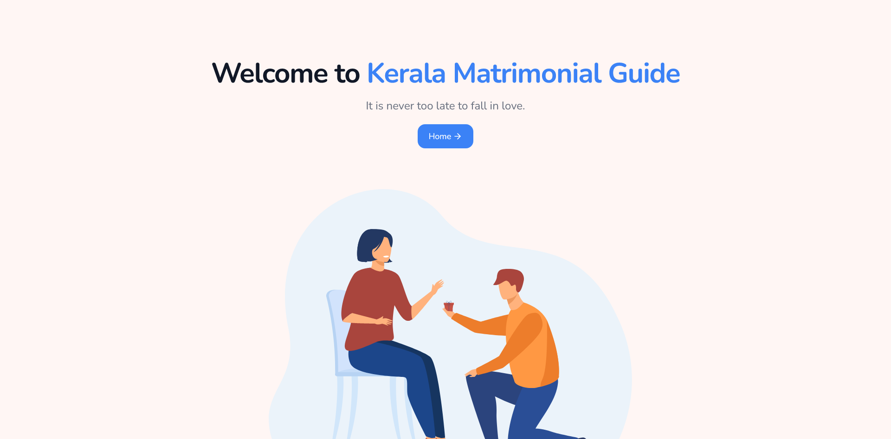
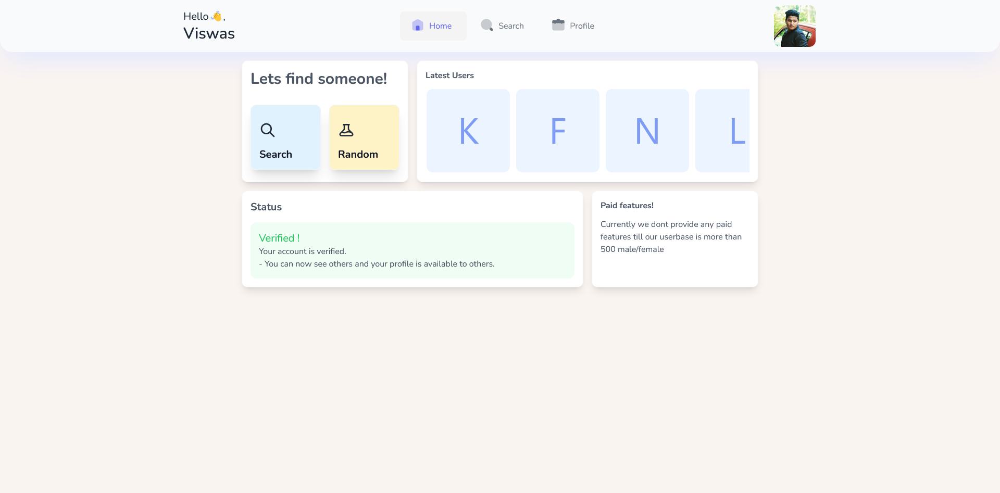
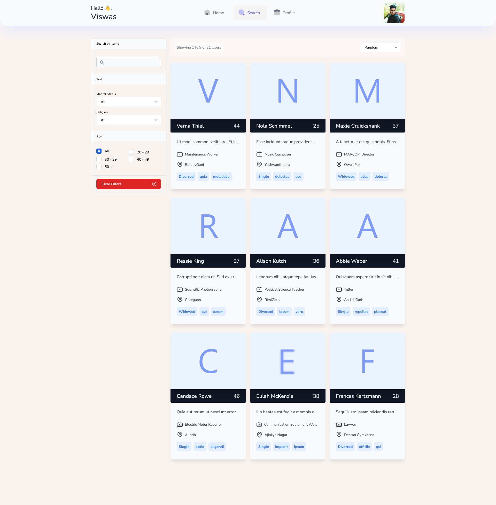
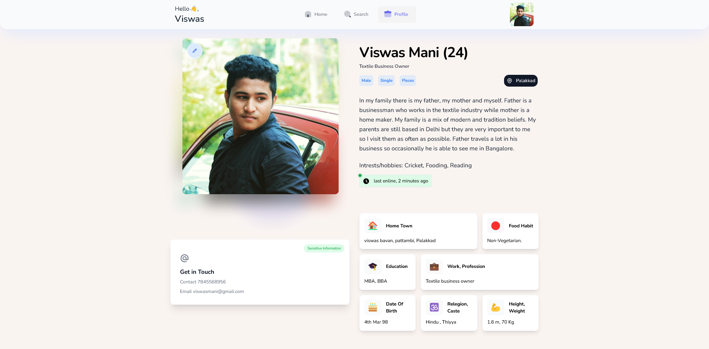

# About kmg

Kerala Matrimonial Guide is a start of a fresh designed matrimonial website made with the help of Tailwind, AlpineJS, Laravel and Livewire.

# Screnshots
## Welcome Page

## Dashboard

## Search

## Profile

